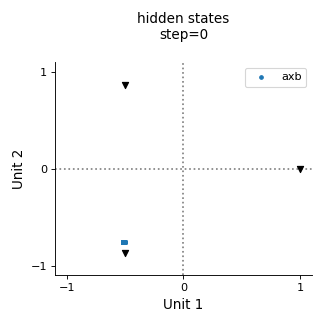
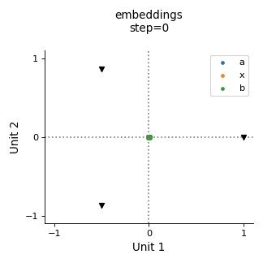
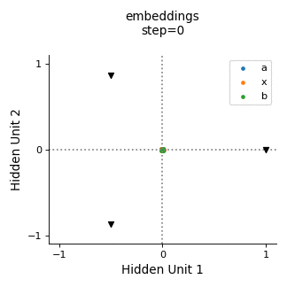

  

Research code for visualizing organization of RNN states during learning

## Usage

Execute `main() in coordinated.job`

## Example Simulations

When mutual information between X and B slot is maximal, 
categorization problem is solved, as seen below,

  

but the embeddings do not inherent the same organization, as shown below.

  

Only when the mutual information between X and B is zero, 
do the embeddings inherent the same 2D organization that exists at the hidden layer, as shown below.

  

## Compatibility

Developed on Ubuntu 16.04 using Python3.7
